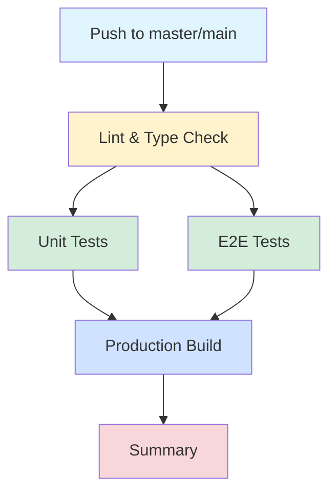

# GitHub Configuration

## 🚀 CI/CD Pipeline

Ten katalog zawiera konfigurację CI/CD dla projektu Home Budget Planner.

## 📖 Dokumentacja

### Zacznij tutaj:

1. **[SECRETS_SETUP.md](./SECRETS_SETUP.md)** 🔑
   - Konfiguracja wymaganych secrets w GitHub
   - Krok po kroku z przykładami
   - **ZACZNIJ OD TEGO PLIKU!**

2. **[CICD_SUMMARY.md](./CICD_SUMMARY.md)** 📋
   - Szybki przegląd całego setupu
   - Architektura pipeline
   - Szybki start w 3 krokach

3. **[CI_CD_GUIDE.md](./CI_CD_GUIDE.md)** 📖
   - Kompletny przewodnik użytkownika
   - Jak uruchamiać pipeline
   - Monitoring i debugging
   - Troubleshooting

4. **[workflows/README.md](./workflows/README.md)** 🔧
   - Szczegółowa dokumentacja workflows
   - Konfiguracja techniczna
   - Optymalizacje

## 🎯 Szybki start

### 1. Skonfiguruj secrets

```bash
# Przejdź do GitHub → Settings → Secrets and variables → Actions
# Dodaj 5 secrets (szczegóły w SECRETS_SETUP.md):
- PUBLIC_SUPABASE_URL
- PUBLIC_SUPABASE_ANON_KEY
- SUPABASE_SERVICE_ROLE_KEY
- E2E_USERNAME
- E2E_PASSWORD
```

### 2. Uruchom pipeline

**Automatycznie:**
```bash
git push origin master
```

**Manualnie:**
```bash
gh workflow run master.yml
```

### 3. Sprawdź status

```bash
gh run list --workflow=master.yml --limit 5
```

## 📁 Struktura

```
.github/
├── workflows/
│   ├── master.yml          ⭐ Główny pipeline CI/CD
│   ├── quick-check.yml     🚀 Szybkie sprawdzenie (bez E2E)
│   ├── test.yml.example    📝 Szablon (nieaktywny)
│   └── README.md           📚 Dokumentacja workflows
│
├── SECRETS_SETUP.md        🔑 START: Konfiguracja secrets
├── CICD_SUMMARY.md         📋 Przegląd i architektura
├── CI_CD_GUIDE.md          📖 Kompletny przewodnik
└── README.md               👈 Ten plik
```

## 🏗️ Pipeline Overview



**Czas wykonania:** ~5-8 minut

## 🎮 Dostępne workflows

### CI Pipeline (master.yml) - GŁÓWNY

**Trigger:**
- ✅ Automatycznie po push do master/main
- ✅ Manualnie przez Actions

**Etapy:**
1. Lint & Type Check (~30s)
2. Unit Tests (~1-2 min)
3. E2E Tests (~3-5 min)
4. Production Build (~1-2 min)
5. Summary (~5s)

**Artefakty:**
- Coverage report (30 dni)
- Playwright report (30 dni)
- Test results (30 dni)
- Production build (7 dni)

### Quick Check (quick-check.yml) - OPCJONALNY

**Trigger:**
- ✅ Tylko manualnie

**Etapy:**
1. Lint & Type Check
2. Unit Tests
3. Production Build

**Czas:** ~2-3 min (bez E2E)

## 🔍 Monitoring

### Przez GitHub UI

```
GitHub → Actions → Wybierz workflow → Zobacz status
```

### Przez CLI

```bash
# Lista runs
gh run list --workflow=master.yml

# Status konkretnego run
gh run view <run-id>

# Live monitoring
gh run watch

# Logi
gh run view --log
```

## 📦 Pobieranie artefaktów

```bash
# Pobierz raport Playwright
gh run download <run-id> -n playwright-report

# Pobierz wszystkie artefakty
gh run download <run-id>
```

## 🐛 Troubleshooting

### Pipeline nie startuje

✅ Sprawdź czy `ci.yml` jest w master branch  
✅ Sprawdź czy workflow jest włączony w Actions  
✅ Sprawdź uprawnienia (Settings → Actions → General)

### E2E testy failują

✅ Sprawdź secrets: `gh secret list`  
✅ Zobacz logi: Actions → Run → E2E Tests  
✅ Pobierz raport: `gh run download <run-id> -n playwright-report`

### Build failuje

✅ Sprawdź czy `PUBLIC_SUPABASE_URL` i `PUBLIC_SUPABASE_ANON_KEY` są ustawione  
✅ Lokalnie: `npm run build`  
✅ Zobacz logi: Actions → Run → Production Build

**Więcej:** [CI_CD_GUIDE.md - Troubleshooting](./CI_CD_GUIDE.md#monitoring-i-debugging)

## 📚 Dodatkowe zasoby

- [GitHub Actions Documentation](https://docs.github.com/en/actions)
- [Playwright Documentation](https://playwright.dev/)
- [Vitest Documentation](https://vitest.dev/)
- [Supabase Documentation](https://supabase.com/docs)

## 🔐 Bezpieczeństwo

⚠️ **NIGDY nie commituj secrets do repozytorium!**

✅ **Używaj GitHub Secrets dla:**
- API keys
- Passwords
- Service role keys
- Inne wrażliwe dane

✅ **Best practices:**
- Dedykowany projekt Supabase dla testów
- Regularnie rotuj service role key
- Monitoruj logi pod kątem wycieków
- Używaj minimalnych uprawnień

## 📞 Wsparcie

**Potrzebujesz pomocy?**

1. 📖 Przeczytaj dokumentację w tym katalogu
2. 🔍 Sprawdź logi: `gh run view --log`
3. 🧪 Reprodukuj lokalnie: `npm run test:all && npm run build`
4. 📧 Skontaktuj się z zespołem

---

**Status:** ✅ Gotowe do użycia  
**Ostatnia aktualizacja:** 2024-12-14  
**Wersja:** 1.0.0

